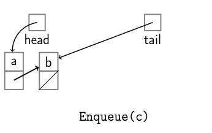
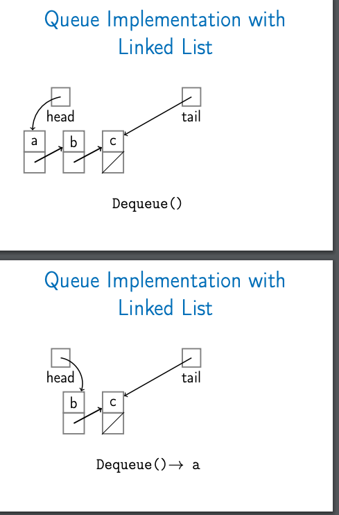
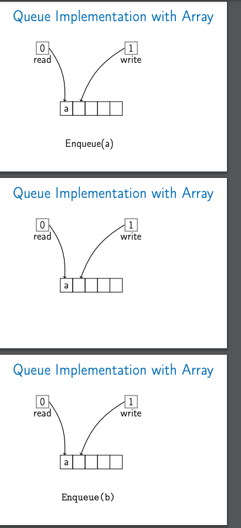
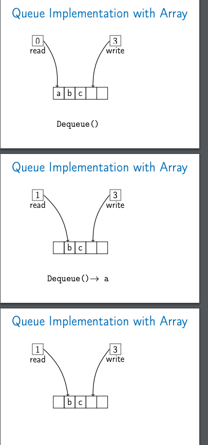

# Data Structures
## Array

### Definition
  - Array is contigous area of memory consisting of equal size elements indexed by contiguous integers

### Constant time access
```ruby
array_addr + element_size ( i - first_index )
```
### Times for common operations
||Add|Remove|
|-|-|-|
|Beginning|O(n)| O(n)|
|End|O(1)|O(1)|
|Middle|O(n)|O(n)|

#### Note:
-  Arrays are greate if you want add or remove at the end but expensive if you want to add ore remove in the middle or
   at the beginning
- We have this constant time access to elements, either read or write
### Preferences
- https://www.coursera.org/learn/data-structures/lecture/OsBSF/arrays

# Preferences:
- https://www.coursera.org/learn/data-structures

## Singly-linked lists
- Node containt
  - Key
  - Next pointer
### List API
  #### PushFront(key) -> add to front - O(1)
  ```
  node <- new node
  node.key <- key
  node.next <- head
  head <- node
  if tail = nil:
    tail <- head
  ```
  #### Key TopFront() -> return front item - O(1)

  #### PopFront() -> Remove front item - O(1)
  ```
  if head = nil:
    Error: empty list

  head <- head.next
  if head = nil
    tail <- nil
  ```

  #### PushBack(key) -> add to back - O(n) || O(1)
  ```
  node <- new node
  node.key <- key
  node.next = nil

  if tail = nil:
    head <- tail <- node
  else
    tail.next <- node
    tail <- node
  ```
  #### Key TopBack() -> return back item - O(n) || O(1)
  #### Popback() -> return back item - O(n)
  ```
  if head = nil: ERROR: empty list

  if head = tail:
    head <- tail <- nil
  else:
    p <- head
    while p.next.next != nil
      p <- p.next
    p.next <- nil; tail <- p
  ```

  #### Boolean Find(Key) -> is key in list? - O(n)
  #### Erase(Key) -> remove key from list - O(n)
  #### Boolean Empty() -> empty list? - O(1)
  #### AddBefore(Node, Key) -> adds key before node - O(n)
  #### AddAfter(Node, Key) -> adds key after node - O(1)
  ```
  node2 <- new node
  node2.key <- key
  node2.next = node.next
  node.next = node2
  if tail = node:
    tail <- node2
  ```

## Doubly-linked lists
- Node containr
  - Key
  - Next pointer
  - Previos pointer
### Pushback(key)
  ```
  node <- new node
  node.key <- key; node.next = nil
  if tail = nil:
    head <- tail <- node
    node.prev <- nil
  else:
    tail.next <- node
    node.prev <- tail
    tail <- node
  ```
### PopBack()
  ```
  if head = nil: Error: empty
  if head = tail:
    head <- tail <- nil
  else:
    tail <- tail.prev
    tail.next <- nil
  ```
### AddAfter(node, key)
  ```
  node2 <- new node
  node2.key <- key
  node2.next <- node.next
  node2.prev <- node
  node.next <- node2
  if node2.next not nil:
    node2.next.prev <- node2
  if tail = node:
    tail <- node2
  ```
### AddBefore(node, key)
  ```
  node2 <- new node
  node2.key <- key
  node2.next <- node
  node2.prev <- node.prev
  node.prev <- node2
  if node2.prev not nil:
    node2.prev.next <- node2
  if head = node:
    head <- node2
  ```
### Running time
  |Doubly linked list|No tail| with tail|
  |-|-|-|
  |PushFront(key)| O(1) | |
  |TopFront() | O(1) | |
  |PopFront() | O(1) | |
  |PushBack(key) | O(n) | O(1) |
  |TopBack(key) | O(n) | O(1) |
  |Find(key) | O(n) | |
  |Erase(key)| O(n) | |
  |Empty| O(1) | |
  |AddBefore(Node, Key)| O(1) | |
  |AddAfter(Node, Key)| O(1) | |
### Note
  - Constant time to insert at or remove from the front
  - With tail and doubly-linked, constant time to insert at or remove from the back
  - O(n) time to ifind arbitrary element
  - Lidst elements need not be contiguous.
  - With doubly linked list, constant time to insert bettween nodes or remove a node.

## Stacks
- Abstract data type with the following operations
  - Push(Key): Adds key to collection
  - Key Top(): return most recently-added key
  - Key Pop(): Removes and returns most recently-added key
  - Boolean Empty(): Are there any elements?
  - Stack can be implemented with either an array or a linked list
  - Each stack operation is O(1): Push, Pop, Top, Empty
  - Stacks are ocassionaly known as LIFO queues

  ### Example:

  ```ruby
  def balanced?(str)
    stack = Stack.new
    str.each do |char|
      next stack.push(char) if ['(', '['].include?(char)

      return false if stack.empty?

      top = stack.pop
      return false if top == '[' && char != ']' || top == '(' && char != ')'
    end

    stack.empty?
  end
  ```
## Queue
  - Abstract data type with the following operations:
    - Enqueue(Key): adds key to collection
    - Key Dequeue(): removes and returns least recently-added key
    - Boolean Empty(): Are there any elements?
    - FIFO - First in first out
  - Can be implemented with either a linked list(**with tails pointer**) or an array
    - Linked list
      #### Enqueue:
      
      #### Dequeue
      
    - Array
      #### Enqueue
      
      #### Dequeue
      
    - Note: Array need to set an emply pointer when the queues not empty to distinguish empty queues
  - Each queue operation is O(1): Enqueue, Dequeue, Empty

## Tree

A tree is:
  - Empty or
  - a node with a key and a list of child trees
### Example: Abstract syntax tree for code

``ruby
  while x < 0
    x += 2
    foo(x)
  end
```

                          while
                      <-         ->
                compare op: <       block
              <-      ->            <-  ->
          var: x    const: 0    assign    procedure call
                                <- ->                    <-       ->
                            var: x  binop: +          var: foo | var: x
                                    <-  ->
                              var: 2     const: 2
### Terminology
  - Node contains
    - key
    - children: list of children nodes
    - parent - optional

  - Binary tree: node containts
    - Key
    - Left
    - Right
    - parent - optional

### Methods

    ```ruby
    # calculate how hight a tree is
    def height(tree)
      return 0  if tree.nil?

      1 + [height(tree.left), height(tree.right)]
    end


    # calculate how many nodes in a tree
    def size(tree)
      return 0  if tree.nil?

      1 + size(tree.left) + size(tree.right)]
    end

    ```


### Tree traversal
Often we want to visit the nodes of a tree in a particular order.
For example, print the nodes of the tree.
  - Depth first: we completely traverse one sub-tree before exploring a sibling sub-tree
  - Breadth first: We traverse all nodes at one level before progressing to the next level

#### Code example
- Depth first
  ```ruby
  def in_order_traversal(tree)
    return if tree.nil?

    in_order_traversal(tree.left)
    puts tree.key
    in_order_traversal(tree.right)
  end

  def pre_order_traversal(tree)
    return if tree.nil?

    puts tree.key
    pre_order_traversal(tree.left)
    pre_order_traversal(tree.right)
  end

  def post_order_traversal(tree)
    return if tree.nil?

    post_order_traversal(tree.left)
    post_order_traversal(tree.right)
    puts tree.key
  end
  ```
- Breadth first
```
def level_traversal(tree)
  return if tree.nil

  q = Queue.new
  q.enqueue(tree)

  while !q.empty?
    node = q.dequeue
    puts node
    if !node.left.nil?
      q.dequeue(node.left)
    if !node.right.nil?
      q.enqueue(node.right)
  end
end
```
### Summary
- Tree are used for lots of different things
- Trees have a key and children
- Tree walks: DFS (pre-order, in order, post-order) and BFS
- when working with a tree, recursive algorithms are common
- In CS, tree grow down!
